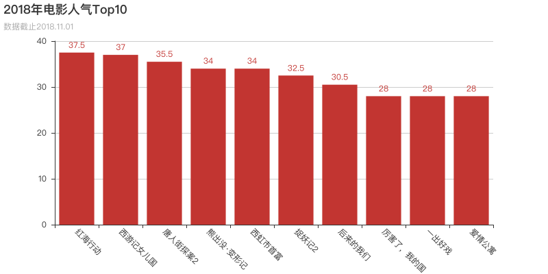
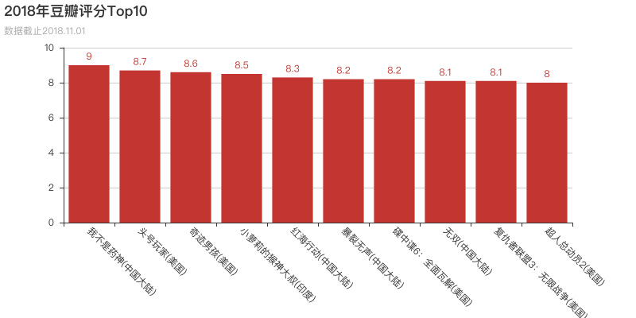
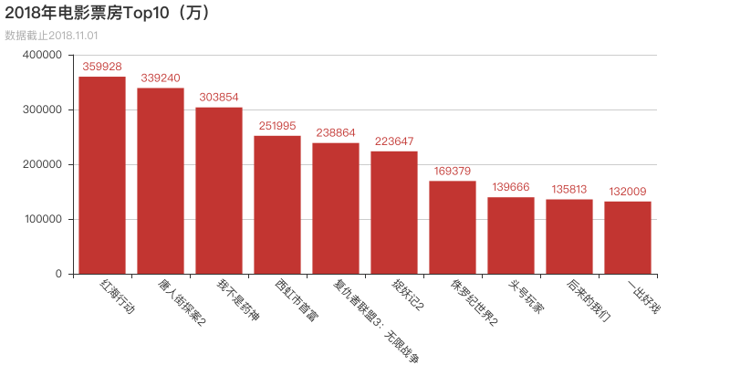
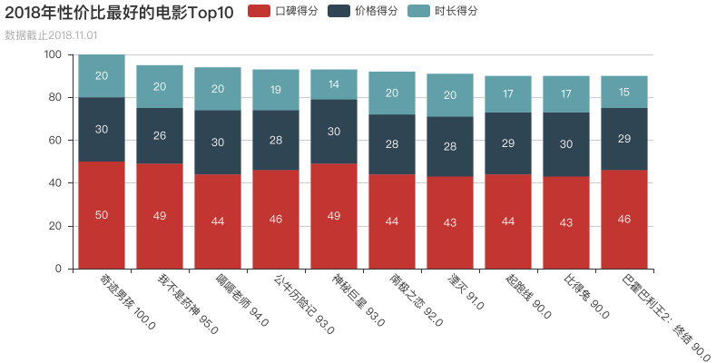
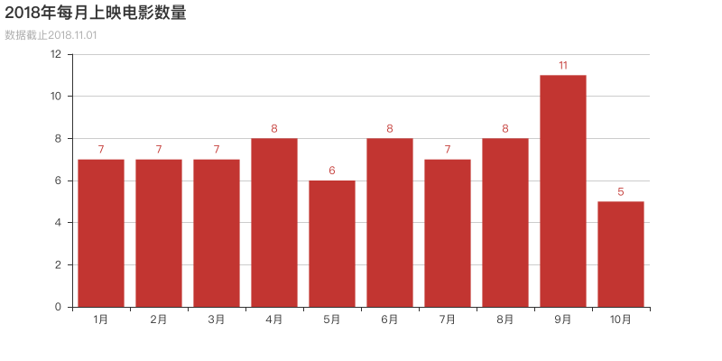
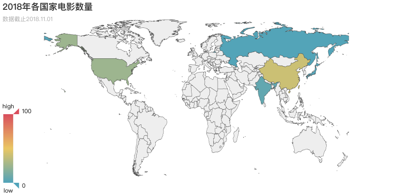
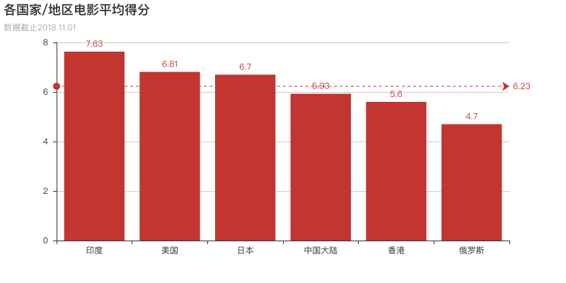
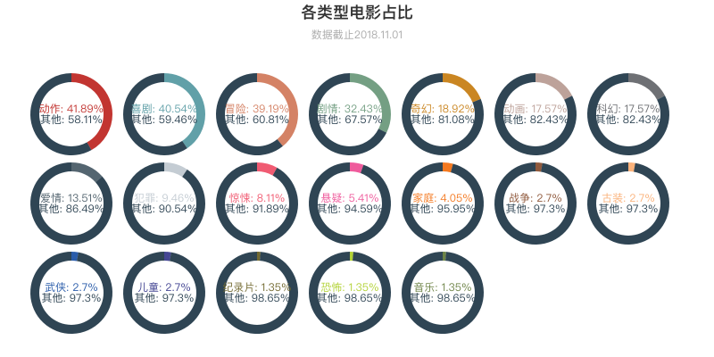

> 收集2018年的电影数据，并对其进行整合、分析。

**关键词**：python3 、 tuShare 、 pyecharts 、 词云图 、 selenium 、 jupyter notebook 、 charles

### 00. 数据获取

通过[tuShare数据接口](https://tushare.pro/register?reg=134080)获取2018年1月至11月每月票房Top10的电影数据（包括影片名称、上映日期、平均票价、当月票房、场均人次、口碑指数），并根据影片名称去豆瓣网爬取了相关数据（包括评分、导演、主演、类型、制片国家/地区、片长）。爬虫采用了selenium模拟浏览器行为，获取到页面后使用xpath解析，得到需要的信息。
对数据进行简单处理后，最终得到有效数据74条。
### 01. 人气Top10
先看看人气最高（场均人次最多）的电影有哪些⬇⬇⬇

### 02. 豆瓣评分Top10
选取了豆瓣评分最高的10部电影绘制了条形图，见下。

Top10中，评分整体还是比较接近的，中美电影各占据半壁江山。

### 03. 票房Top10

接下来再看个更现实的指标，票房Top10，见下。

嗯，这一年好像没少看电影，我为4部做过贡献……

### 04. 性价比Top10

各种指标排出来的名次都不一样，到底该先宠信谁呢，这让纠结症患者怎么办？那我们就来算算综合分数，看看综合排名吧。**此处以我自己的标准进行计算，计算结果仅供参考。**

- **口碑**：口碑指数当然是越高越好了，占比 50%
- **价格**：越便宜越好，占比 30%
- **时长**：太短的可能情节太紧凑，太长的可能会显得拖沓，所以就跟平均时长进行比较吧，越靠近平均时长的，得分越高，占比 20%

按100分来计算的话，我的计算公式如下：
**口碑指数/最高口碑 * 50 + 最低价/价格 * 30 + (平均时长-abs(时长-平均时长))/平均时长 * 20**
算出74部电影各自的分数后，取分数最高的10部电影绘制了条形图，见下。

感觉绝大部分都比较陌生……尤其这个“奇迹男孩”，竟然100分！！！有时间了看看去。

### 05. 几月上新多？

按上映月份统计了一下，虽然数据少，还是能看出来一点东西的。统计图表见下。

除了9月和10月外，其他月份好像都比较平庸。想了想，9月是暑假，是不是10月的电影都抢档期到9月去播放了……

### 06. 各国家电影数量

就这么多数据，想想还能干什么……看看各国家电影数量吧。按国家（港澳台和大陆统计到了一起）统计电影数量后绘制了地图，见下。

如图所示，电影数量方面，我国和美国遥遥领先。

### 07. 各国家电影均分

不是说国产电影质量不行吗，要不看看各国家/地区的豆瓣评分平均值吧。按国家/地区计算电影均分后绘制了条形图，见下。

emm……大陆倒3，香港倒2……看来质量是有待提高啊……

### 08. 各类型电影占比

接下来，看一下当前什么类型的电影比较火。按各类型电影占比绘制了饼图（因1部电影会有多个类型，所以总和会大于100%，而且前几名的占比有点高，取前几名的数据在一个饼图里也盛不下，所以绘制了下面这么一幅饼图）。

（跟一堆甜甜圈似的，看的我都饿了）

从图中来看，动作、喜剧、冒险、剧情占据了绝大多数的市场份额。但是爱情竟然只有13.51%，不科学啊，我咋感觉每部电影都是爱情片……

### 09. 各演员电影产量

统计一下各演员分别拍了多少部电影吧。以python的logo为底图，绘制了词云图，如下。

产量较高的有：徐峥、于和伟、大鹏……

### 10. 各导演电影产量

看完了各主演的产量，再看看各导演的产量呗。看到统计结果，我吃了一惊，所有的导演都很专一，产量都是1——好像也没必要画统计图了，原汁原味的DataFrame表格了解一下？见下。

### 写在最后

- 本次数据分析数据量比较少，纯属为了练手，分析的结果基本没什么价值，大家就随便看看当放松吧。
- 最近在自学python。个人感觉相比java，python的开发效率还是很可观，自己做点东西、搞点事情用起来还是很方便的。有小伙伴上车吗，一起啊！
- 第一次写这种文章，感觉自己还是写的很艰难的，写出来的东西也很空洞，欢迎各位大佬批评指点。

---

源代码：https://github.com/RamblerW/python_zen/tree/master/_20181109_analyzeMoives